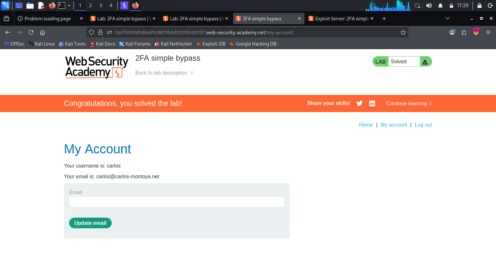

# PortSwigger Lab: 2FA Simple Bypass

## 🎯 Objective
The goal of this lab was to bypass the application's two-factor authentication (2FA) mechanism. While I possessed the victim's valid username and password, I did not have access to their 2FA verification code. The objective was to successfully access the victim's account page (`carlos`) without completing the 2FA step.

## ⚠️ Vulnerability & Business Impact
This application suffers from a **Logical Flaw** in its authentication process. The server fails to strictly enforce the completion of the 2FA step before granting access to authenticated endpoints. If an attacker obtains valid credentials (e.g., via phishing or credential stuffing), they can simply navigate directly to the account dashboard, completely bypassing the intended security benefits of 2FA. This leads to direct Account Takeover (ATO).

## 🛠️ Tools Used
*   **Burp Suite Professional** (Proxy and HTTP History)
*   Manual Browser Navigation

## 📝 Step-by-Step Exploitation

**Step 1: Understanding the Legitimate Flow**
First, I logged into my own provided account (`wiener:peter`) to observe the normal authentication flow. I noted that after entering the username and password, the application redirects to a 2FA verification page. Only after submitting the code sent via the "Email client" was I granted access to the `/my-account` page.

**Step 2: Identifying the Target Endpoint**
While logged into my own account, I made a specific note of the URL for the user dashboard: `/my-account`. I then logged out to test if the victim's account handled this endpoint securely.

<!-- 📸 ADD YOUR BURP PROXY SCREENSHOT HERE (The one showing the GET /my-account request in the HTTP history) -->

**Step 3: Initiating the Attack**
I navigated back to the login page and entered the victim's known credentials (`carlos:montoya`).

<!-- 📸 ADD YOUR LOGIN SCREENSHOT HERE (The one showing the credentials entered into the form) -->

**Step 4: Bypassing the 2FA Check**
After submitting the credentials, the application prompted me for Carlos's 2FA verification code. Since I did not have this code, I tested for a logical bypass. Instead of attempting to guess the code, I manually changed the URL in the browser's address bar to the dashboard endpoint I identified earlier: `/my-account`.

**Step 5: Account Takeover**
The server accepted the request without verifying if the 2FA step had been completed. The page loaded successfully, granting me full access to Carlos's account and solving the lab.

📸 

## 🧠 Key Takeaways
This lab demonstrates that security controls must be enforced at every step of a process, not just linearly. The server must verify that a session is fully authenticated (including 2FA completion) before serving any sensitive pages or API endpoints, rather than simply relying on the client to follow the intended sequence of pages.
