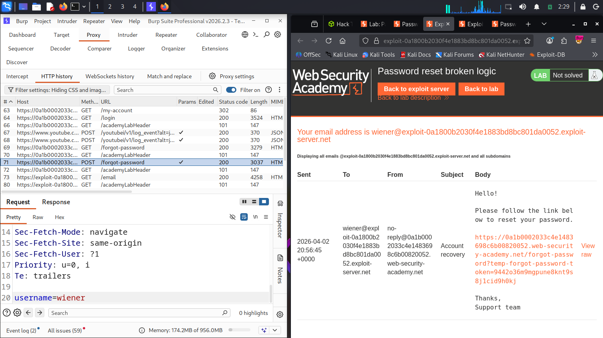
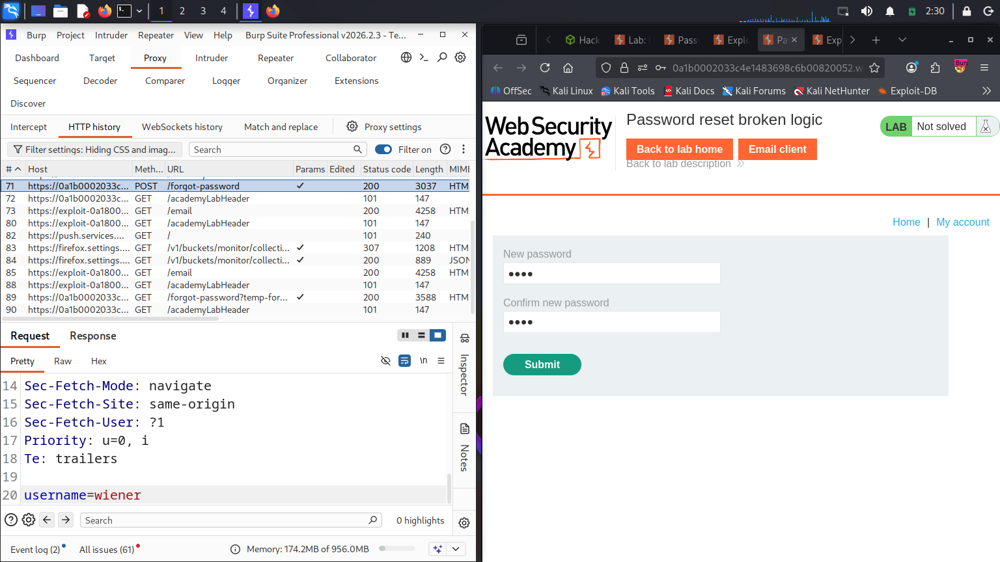
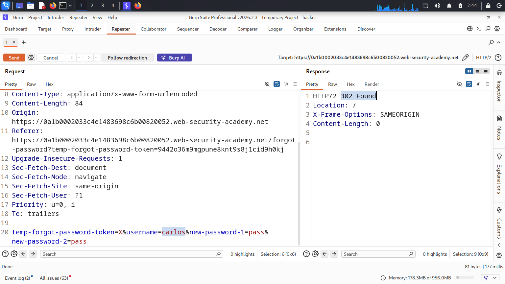
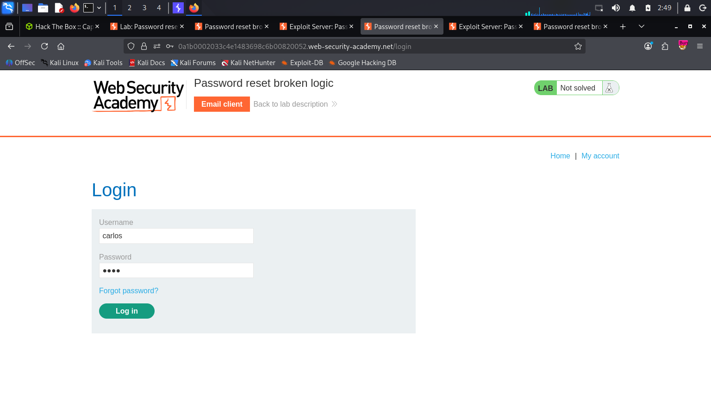
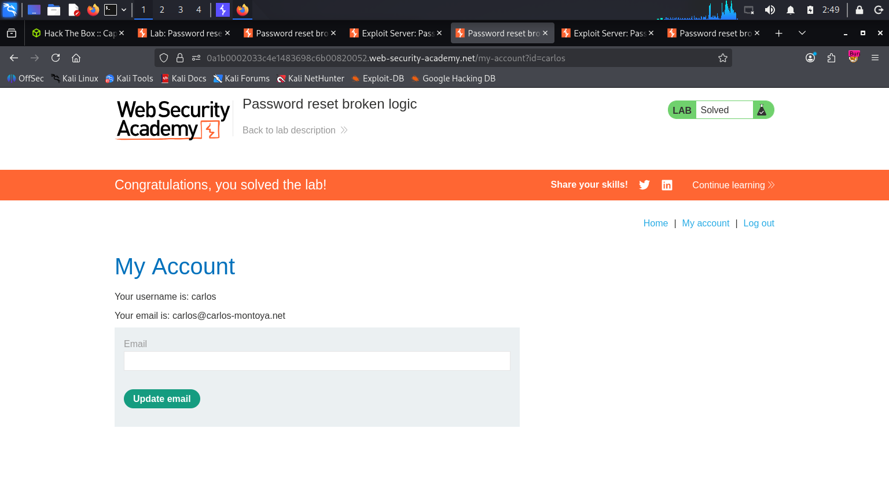

# PortSwigger Lab: Password Reset Broken Logic

## 🎯 Objective
The goal of this lab was to exploit a logical flaw in the password reset functionality to reset the password for another user (`carlos`) and gain unauthorized access to their account.

## ⚠️ Vulnerability & Business Impact
This application suffers from **Broken Access Control / Broken Logic** within its password reset mechanism. The backend server relies on a user-controllable parameter (a hidden `username` field) to determine which account's password should be updated, rather than securely deriving the user identity strictly from the password reset token itself. 

Furthermore, the server fails to properly validate the reset token against the submitted username. An attacker can intercept the reset request, manipulate the `username` parameter to target a victim, and bypass the token validation, resulting in a zero-click Account Takeover (ATO).

## 🛠️ Tools Used
*   **Burp Suite Professional** (Proxy and Repeater)
*   Provided Exploit Server (Email Client)

## 📝 Step-by-Step Exploitation

**Step 1: Analyzing the Legitimate Reset Flow**
To understand how the application handles password resets, I initiated a legitimate password reset request for my own controlled account (`wiener`). I accessed the email client on the exploit server and clicked the reset link, which contained a unique `temp-forgot-password-token` in the URL.

📸 . 

**Step 2: Intercepting the Password Update Request**
I filled out the form to create a new password and submitted it. Using Burp Suite Proxy, I intercepted the `POST /forgot-password` request. I noticed that the request body contained a hidden parameter: `username=wiener`.

📸 . 

**Step 3: Manipulating the Logic in Burp Repeater**
I sent the intercepted request to **Burp Repeater** to test the backend logic. I wanted to see if the server trusted the `username` parameter over the token. 
*   I changed the `username` parameter from `wiener` to the victim's username: `carlos`.
*   I also tampered with the `temp-forgot-password-token`, changing its value to `X` to test if the server was even validating the token's integrity.
*   I sent the manipulated request and received a `302 Found` response, indicating that the backend processed the password change successfully without verifying if the token actually belonged to `carlos` (or if it was even valid).

📸 . 
**Step 4: Account Takeover**
With the victim's password successfully reset to a value of my choosing (`pass`), I navigated to the login page and authenticated as `carlos`.

📸 . 

The authentication was successful, granting me full access to the victim's dashboard and solving the lab.

📸 . 

## 🧠 Key Takeaways
This vulnerability highlights a critical rule in secure application development: **Never trust client-side input for sensitive operations.** 
Password reset functionality should rely *exclusively* on a secure, unpredictable, and time-limited token. The backend must strictly associate this token with the correct user account in the database. It should never rely on hidden form fields or URL parameters to identify which user is requesting the password change.
