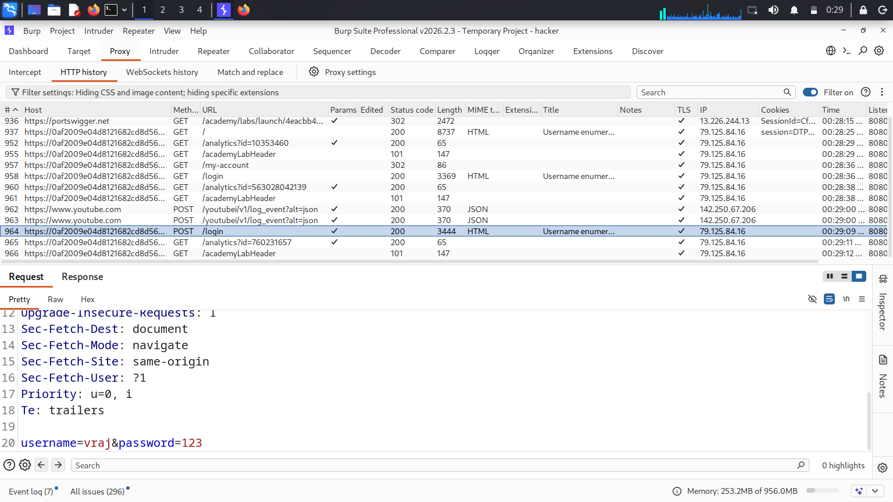
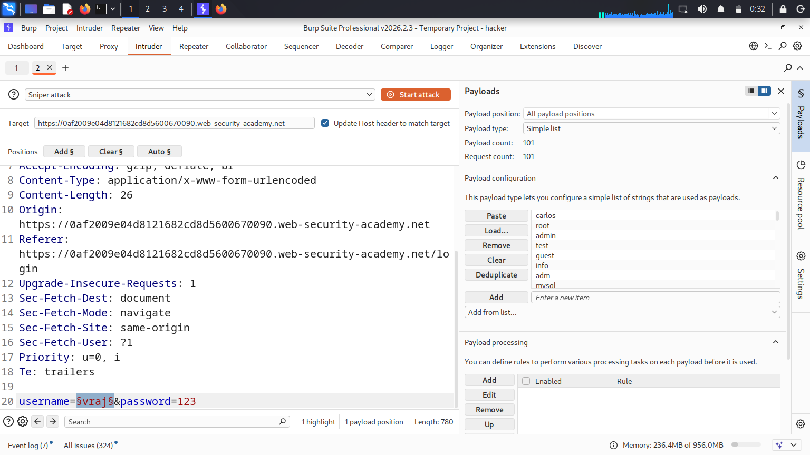
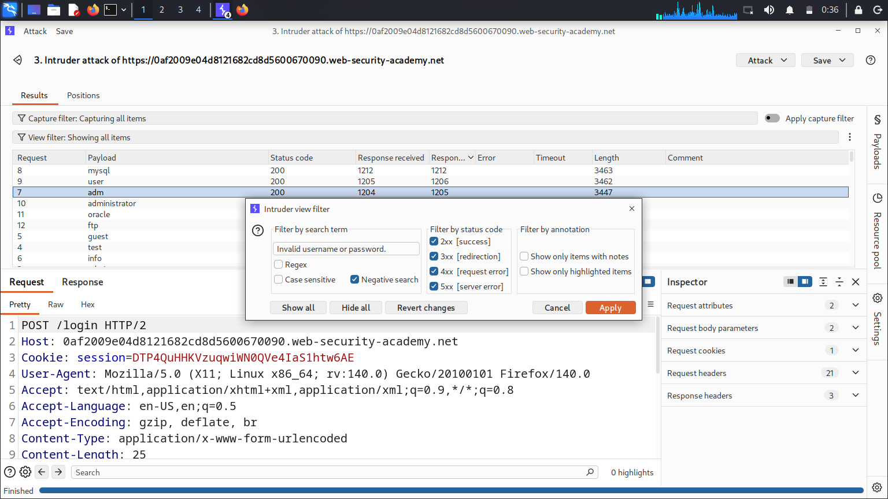
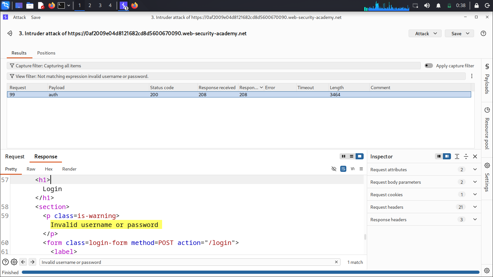
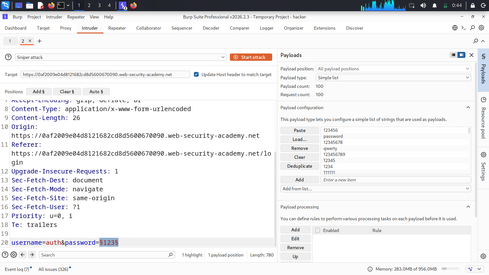
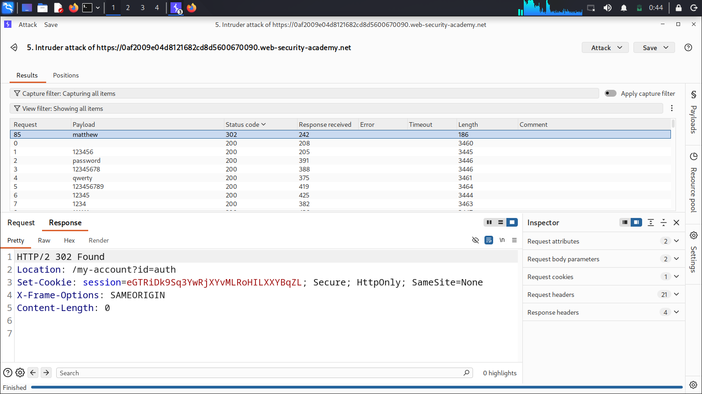
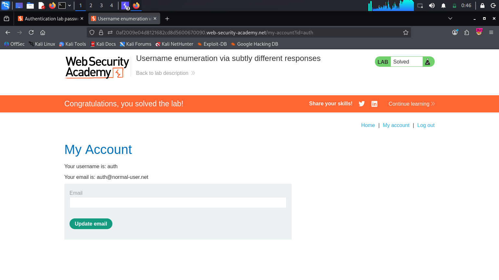

# PortSwigger Lab: Username Enumeration via Subtly Different Responses

## 🎯 Objective
The goal of this lab was to enumerate a valid username by analyzing a subtle, character-level difference in the application's authentication error messages. Once the valid username was identified, the objective was to brute-force the password and gain access to the account.

## ⚠️ Vulnerability & Business Impact
This application is vulnerable to **Information Disclosure via Authentication Responses**. While the application attempts to use a generic "Invalid username or password" message to prevent username enumeration, a typographical error exists in the backend code. When a *valid* username is submitted with an *invalid* password, the error message is subtly different (missing a period). 

An attacker can leverage this minor discrepancy to confidently enumerate valid accounts on the system, which paves the way for targeted password brute-forcing and eventual Account Takeover (ATO).

## 🛠️ Tools Used
*   **Burp Suite Professional** (Intruder, Grep-Extract, and Advanced View Filters)

## 📝 Step-by-Step Exploitation

**Step 1: Intercepting the Authentication Traffic**
I started by submitting dummy credentials (`vraj:123`) on the login page. Using Burp Suite Proxy, I intercepted the `POST /login` request to capture the `username` and `password` parameters.

📸 

**Step 2: Username Enumeration Setup**
I sent the intercepted request to **Burp Intruder**. I set a single payload position on the `username` parameter and loaded the provided dictionary of candidate usernames. 

📸  

**Step 3: Isolating the Subtle Difference using Filters**
I initiated the Sniper attack. Because the difference in the response was only a single punctuation mark, simply sorting by response length was not enough. 
To isolate the anomaly, I used Burp Intruder's **View Filter** feature. I configured a "Negative search" for the exact string: `Invalid username or password.` (including the period). 

📸  

This advanced filtering immediately hid all standard responses and revealed a single anomalous request: the username `auth`. This response returned a typoed error message missing the final period, confirming `auth` as a valid user in the database.

📸   

**Step 4: Password Brute-forcing**
Having confirmed the valid username, I cleared the previous Intruder configuration. I updated the request to use the enumerated username (`username=auth`) and set a new payload position entirely on the `password` parameter.

📸 

I loaded the candidate passwords list and started the attack. I monitored the HTTP status codes and observed that the payload `matthew` resulted in a `302 Found` response, indicating a successful login attempt.

📸  

**Step 5: Account Takeover**
I returned to the browser, entered the discovered credentials (`auth` : `matthew`), and successfully authenticated, solving the lab.

📸 

## 🧠 Key Takeaways
This lab is a perfect reminder that security by obscurity fails if implementation is flawed. Generic error messages must be **100% identical** (at the byte level) regardless of whether the username exists or not. A single missing period is enough for an attacker to enumerate an entire user database using automated tools.
