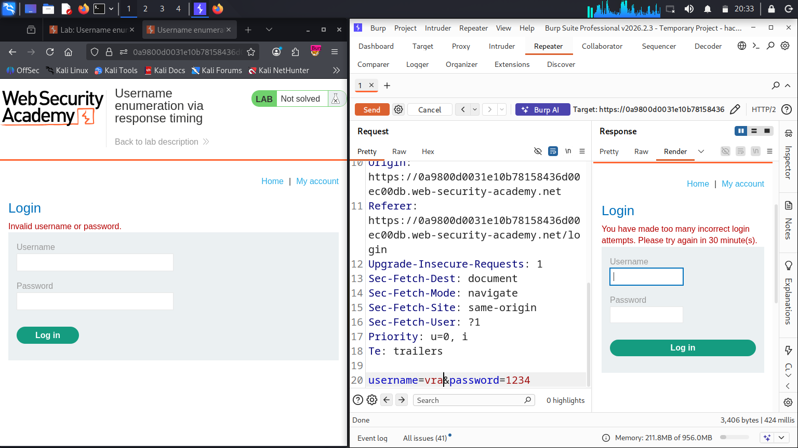
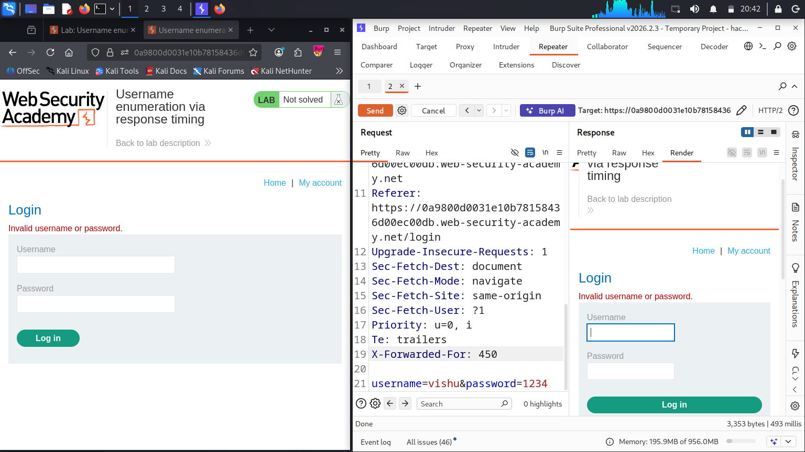
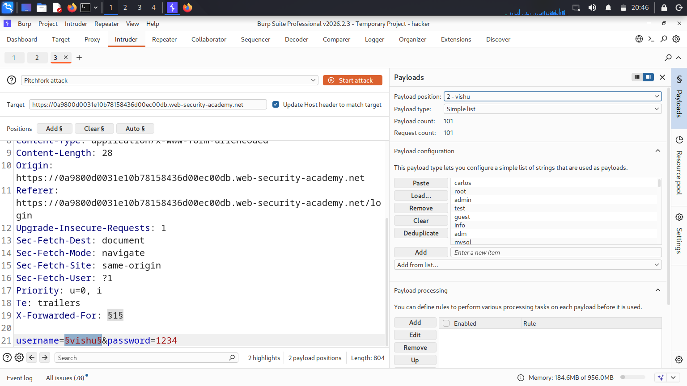
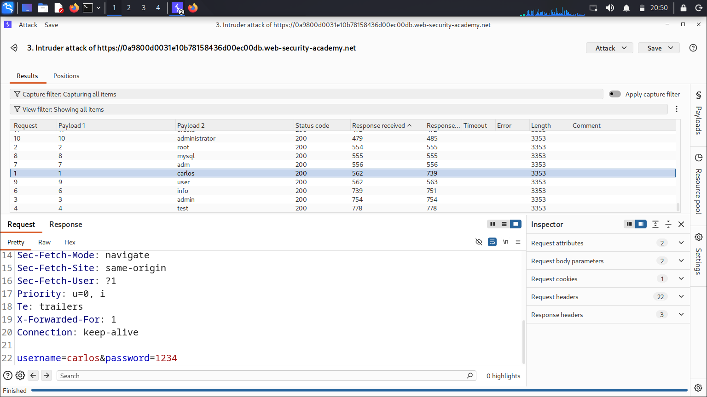
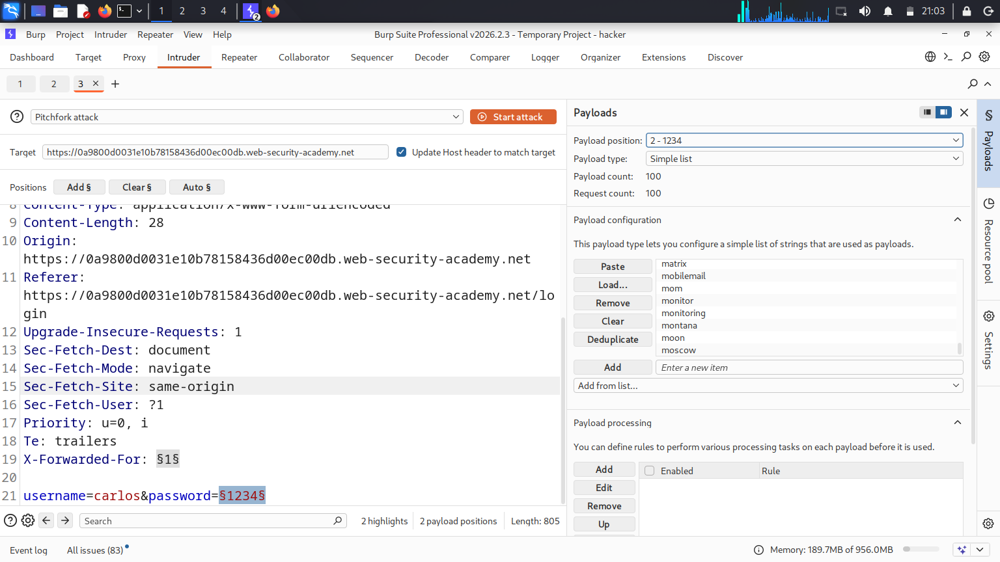
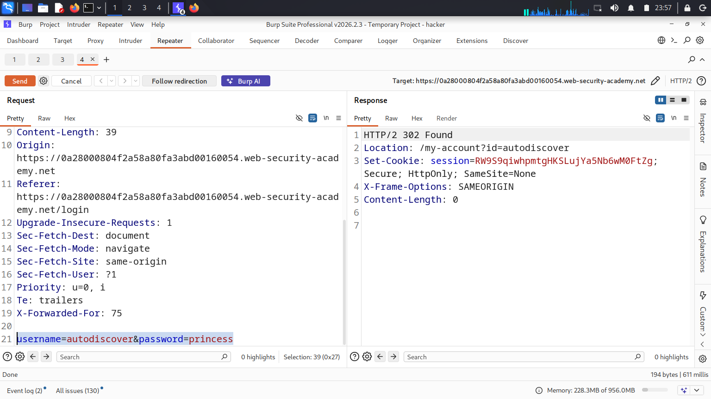
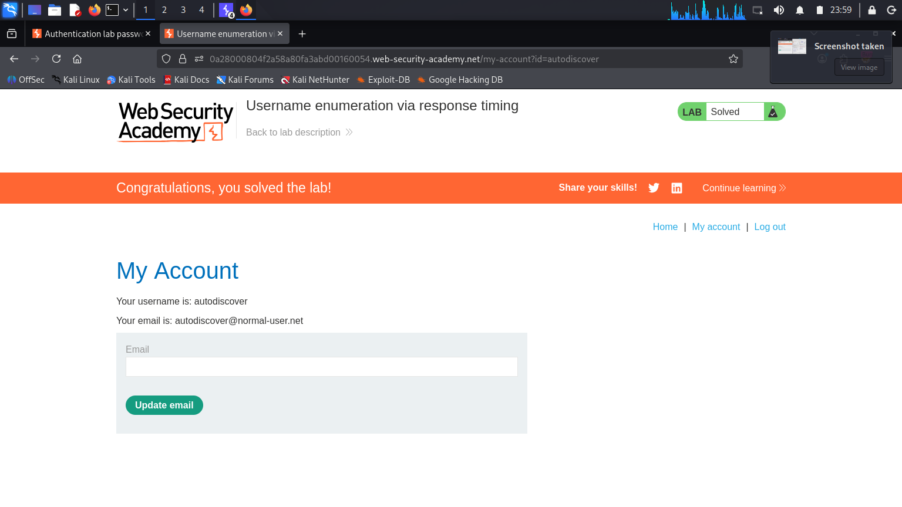

# PortSwigger Lab: Username Enumeration via Response Timing

## 🎯 Objective
The goal of this lab was to bypass the application's IP-based brute-force protection, enumerate a valid username by analyzing subtle differences in server response times, and ultimately brute-force the password to compromise the account.

## ⚠️ Vulnerability & Business Impact
This application suffers from two critical flaws:
1.  **Flawed Rate Limiting:** The brute-force protection relies on the `X-Forwarded-For` HTTP header to track IP addresses. Since this is a client-controlled header, an attacker can trivially spoof it to bypass the lockout mechanism.
2.  **Timing Attack (Information Disclosure):** The backend authentication logic is vulnerable to a timing attack. If a submitted username exists in the database, the server proceeds to hash the submitted password to compare it. This hashing process takes a measurable amount of time. If the username is invalid, the server rejects the request immediately. An attacker can measure this time delay to confidently enumerate valid usernames.

Combined, these vulnerabilities allow a remote attacker to perform undetected, continuous brute-force attacks leading to Account Takeover (ATO).

## 🛠️ Tools Used
*   **Burp Suite Professional** (Repeater, Intruder - Pitchfork Attack, Custom Columns)

## 📝 Step-by-Step Exploitation

**Step 1: Identifying the Brute-Force Protection**
I began by intercepting a standard login request (`POST /login`) and sending it to Burp Repeater. After submitting several incorrect login attempts, the application blocked my IP address, returning the error: *"You have made too many incorrect login attempts. Please try again in 30 minute(s)."*

📸  

**Step 2: Bypassing the Rate Limit**
To bypass this protection, I tested whether the server trusted the `X-Forwarded-For` header. I added `X-Forwarded-For: 450` to the HTTP request in Repeater. The server accepted the request and returned the standard "Invalid username or password" message, confirming the IP block was successfully bypassed via header spoofing.

📸    

**Step 3: Username Enumeration via Timing Attack**
With the rate limit defeated, I moved to **Burp Intruder** to enumerate the username. I configured a **Pitchfork** attack with two payload positions:
*   Payload 1: `X-Forwarded-For: §1§` (Configured with a Numbers payload to constantly change the IP).
*   Payload 2: `username=§vishu§` (Configured with the candidate usernames list).
*   *Note: I supplied an exceptionally long password string to force the backend hashing algorithm to work harder, deliberately amplifying the time delay for a valid username.*

📸   

Before starting the attack, I enabled the `Response received` and `Response completed` columns in Intruder to track timing. Upon reviewing the results, one username (`autodiscover`) took significantly longer to process than the baseline invalid usernames, confirming its existence in the database.

📸    

**Step 4: Password Brute-Forcing**
Having identified the valid user (`autodiscover`), I configured a second Pitchfork attack in Intruder. I kept the `X-Forwarded-For` payload to continue bypassing the rate limit, but hardcoded the known username and placed the second payload position on the `password` parameter.

📸    

I ran the attack and monitored the HTTP status codes. The payload `princess` returned a `302 Found` response and a session cookie, indicating a successful login.

📸    

**Step 5: Account Takeover**
I navigated to the `/login` page in the browser, submitted the discovered credentials (`autodiscover` : `princess`), and successfully accessed the account, solving the lab.

📸    

## 🧠 Key Takeaways
*   **Never trust client headers for security controls:** IP-based blocking must rely on the actual TCP connection IP (Layer 3), not HTTP headers like `X-Forwarded-For` which can be trivially manipulated.
*   **Mitigating Timing Attacks:** Authentication routines must be carefully designed to operate in relatively constant time to avoid leaking state information.
